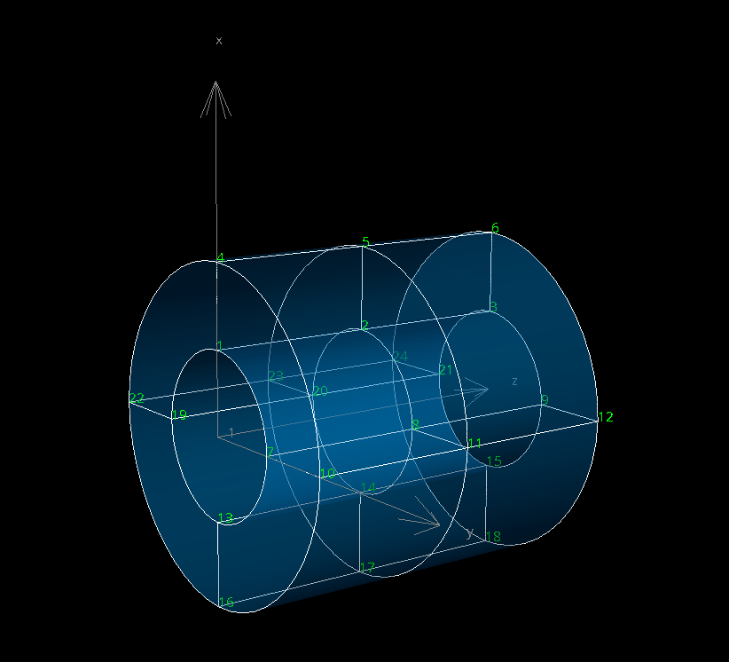

.. _tube:

Creating a 3D tube
====================

.. role:: pyth(code)
  :language: python

Once you have create a :ref:`single-element cube <cube>`, let's try to make a 3D tube with more than 1 element.

Set-up files and modules
-------------------------
Create a file and name it :file:`meshtype_3d_tube2.py` in
the :file:`.\\src\\scaffoldmaker\\meshtypes` folder. Remember to load it in :file:`.\\src\\scaffoldmaker\\scaffolds.py`. Then :pyth:`import` the following
modules which help us to create field, nodes, elements and interpolation functions.

.. code-block:: python

    from __future__ import division
    import math
    from opencmiss.utils.zinc.field import findOrCreateFieldCoordinates
    from opencmiss.zinc.element import Element, Elementbasis
    from opencmiss.zinc.field import Field
    from opencmiss.zinc.node import Node
    from scaffoldmaker.meshtypes.scaffold_base import Scaffold_base
    from scaffoldmaker.utils.eftfactory_tricubichermite import eftfactory_tricubichermite

Creating user interface options
-------------------------------

As mentioned, this time we will let the user decide the number of elements in each direction.
Therefore we should set-up the user interface options as followed:

.. code-block:: python

    ...
    class MeshType_3d_tube3(Scaffold_base):
        @staticmethod
        def getName():
            return '3D Tube 3'

        @staticmethod
        def getDefaultOptions(parameterSetName='Default'):
            return {
                'Number of elements around' : 4,
                'Number of elements along' : 2,
                'Number of elements through wall' : 1,
                'Wall thickness' : 0.25,
                'Inside radius' : 0.25,
                'Use cross derivatives' : False,
            }

        @staticmethod
        def getOrderedOptionNames():
            return [
                'Number of elements around',
                'Number of elements along',
                'Number of elements through wall',
                'Wall thickness',
                'Tube length',
                'Use cross derivatives',
            ]

        @staticmethod
        def checkOptions(options):
            for key in [
                'Number of elements along',
                'Number of elements through wall']:
                if options[key] < 1:
                    options[key] = 1
            if (options['Number of elements around'] < 3) :
                options['Number of elements around'] = 3
            if (options['Wall thickness'] < 0.0) :
                options['Wall thickness'] = 0.0
            elif (options['Wall thickness'] > 0.5) :
                options['Wall thickness'] = 0.5

Everything is pretty similar to what we have done in the :ref:`3D cube <cube>` tutorial. Feel free to add your own options or constraints.

Creating the mesh
----------------------

Before locating each nodes, we have to initialize the following objects and classes:

* All the options values
* Mathematical field
* Coordinates
* Nodes class and node templates
* Mesh
* Interpolation function, element template, and element field template.
* cache

.. code-block:: python

    ...
    class MeshType_3d_tube3(Scaffold_base):
        ...
        @classmethod
        def generateBaseMesh(cls, region, options):
            elementsCountAround = options['Number of elements around']
            elementsCountAlong = options['Number of elements along']
            elementsCountThroughWall = options['Number of elements through wall']
            wallThickness = options['Wall thickness']
            useCrossDerivatives = options['Use cross derivatives']

            fm = region.getFieldmodule()
            fm.beginChange()
            coordinates = findOrCreateFieldCoordinates(fm)
            nodes = fm.findNodesetByFieldDomainType(Field.DOMAIN_TYPE_NODES)
            nodetemplate = nodes.createNodetemplate()
            nodetemplate.defineField(coordinates)
            nodetemplate.setValueNumberOfVersions(coordinates, -1, Node.VALUE_LABEL_VALUE, 1)
            nodetemplate.setValueNumberOfVersions(coordinates, -1, Node.VALUE_LABEL_D_DS1, 1)
            nodetemplate.setValueNumberOfVersions(coordinates, -1, Node.VALUE_LABEL_D_DS2, 1)
            nodetemplate.setValueNumberOfVersions(coordinates, -1, Node.VALUE_LABEL_D_DS3, 1)
            if useCrossDerivatives:
                nodetemplate.setValueNumberOfVersions(coordinates, -1, Node.VALUE_LABEL_D2_DS1DS2, 1)
                nodetemplate.setValueNumberOfVersions(coordinates, -1, Node.VALUE_LABEL_D2_DS1DS3, 1)
                nodetemplate.setValueNumberOfVersions(coordinates, -1, Node.VALUE_LABEL_D2_DS2DS3, 1)
                nodetemplate.setValueNumberOfVersions(coordinates, -1, Node.VALUE_LABEL_D3_DS1DS2DS3, 1)

            mesh = fm.findMeshByDimension(3)
            tricubichermite = eftfactory_tricubichermite(mesh, useCrossDerivatives)
            eft = tricubichermite.createEftBasic()
            elementtemplate = mesh.createElementtemplate()
            elementtemplate.setElementShapeType(Element.SHAPE_TYPE_CUBE)
            result = elementtemplate.defineField(coordinates, -1, eft)
            cache = fm.createFieldcache()

For each node, we want to calculate its global coordinates :math:`u`, and its derivatives with respect to the local coordinates
:math:`\frac{du}{d\zeta}|_1, \frac{du}{d\zeta}|_2, \frac{du}{d\zeta}|_3`. Here is an example:

.. code-block:: python

    ...
    class MeshType_3d_tube3(Scaffold_base):
        ...
        def generateBaseMesh(cls, region, options):
            ...
            # create nodes
            nodeIdentifier = 1
            radiansPerElementAround = 2.0 * math.pi / elementsCountAround
            wallThicknessPerElement = wallThickness / elementsCountThroughWall
            lengthPerElement = 1 / elementsCountAlong
            insideRadius = 0.25
            # scale factor for along, wall thickness, around
            scale = [lengthPerElement, wallThicknessPerElement, 0.0]
            zero = [0.0, 0.0, 0.0]
            for n3 in range(elementsCountAround):
                radian = radiansPerElementAround * n3
                for n2 in range(elementsCountThroughWall + 1):
                    radius = insideRadius + wallThicknessPerElement * n2
                    scale[2] = radiansPerElementAround * radius # the scale factor
                    for n1 in range(elementsCountAlong + 1):
                        u = [radius * math.cos(radian), radius * math.sin(radian), n1 * lengthPerElement]
                        du_ds1_scaled = [0.0, 0.0, scale[2]] # along
                        du_ds2_scaled = [math.cos(radian) * scale[1], math.sin(radian) * scale[1], 0.0] # thickness
                        du_ds3_scaled = [-math.sin(radian) * scale[2], math.cos(radian) * scale[2], 0.0] # around

                        node = nodes.createNode(nodeIdentifier, nodetemplate)
                        cache.setNode(node)
                        coordinates.setNodeParameters(cache, -1, Node.VALUE_LABEL_VALUE, 1, x)
                        coordinates.setNodeParameters(cache, -1, Node.VALUE_LABEL_D_DS1, 1, du_ds1_scaled)
                        coordinates.setNodeParameters(cache, -1, Node.VALUE_LABEL_D_DS2, 1, du_ds2_scaled)
                        coordinates.setNodeParameters(cache, -1, Node.VALUE_LABEL_D_DS3, 1, du_ds3_scaled)

                        if useCrossDerivatives:
                            coordinates.setNodeParameters(cache, -1, Node.VALUE_LABEL_D2_DS1DS2, 1, zero)
                            coordinates.setNodeParameters(cache, -1, Node.VALUE_LABEL_D2_DS1DS3, 1, zero)
                            coordinates.setNodeParameters(cache, -1, Node.VALUE_LABEL_D2_DS2DS3, 1, zero)
                            coordinates.setNodeParameters(cache, -1, Node.VALUE_LABEL_D3_DS1DS2DS3, 1, zero)
                        nodeIdentifier += 1

Here, we define that :math:`\zeta_1, \zeta_2, \zeta_3` are the element parameters along the tube, through the wall, and around the tube respectively. We can find the derivatives by multiplying the arc-length
based derivatives and the corresponding scale factor. In this case, we set all cross derivatives to zero.

With all nodal values set, we need to construct elements. Unlike the 3D cube example, where we only
have 1 element, arranging node identifiers in this case can be a little bit tricky.

.. code-block:: python

    ...
    class MeshType_3d_tube3(Scaffold_base):
        ...
        def generateBaseMesh(cls, region, options):
            ...
            elementIdentifier = 1
            multiplier = (elementsCountThroughWall + 1) * (elementsCountAlong + 1)
            totalNodes = (elementsCountAlong + 1) * (elementsCountThroughWall + 1) * elementsCountAround

            for e3 in range(elementsCountAround):
                for e2 in range(elementsCountThroughWall) :
                    for e1 in range(elementsCountAlong):
                        element = mesh.createElement(elementIdentifier, elementtemplate)
                        n1 = 1 + e1 + (elementsCountAlong + 1) * e2 + e3 * multiplier
                        n2 = n1 + 1
                        n3, n4 = n1 + elementsCountAlong + 1 , n2 + elementsCountAlong + 1
                        n5, n6 = n1 + multiplier, n2 + multiplier
                        n7, n8 = n5 + elementsCountAlong + 1, n6 + elementsCountAlong + 1
                        nodeIdentifiers = [*map(lambda value: value - totalNodes if value > totalNodes else value,
                                              [n1, n2, n3, n4, n5, n6, n7, n8])]
                        result = element.setNodesByIdentifier(eft, nodeIdentifiers)
                        print(elementIdentifier,nodeIdentifiers)
                        elementIdentifier += 1
            fm.endChange()
            return []

If you look back, our node identifiers accumulate in the following order:

* along the tube :pyth:`e1`
* through the wall :pyth:`e2`
* around the tube :pyth:`e3`

Thus, we can address the first node identifier in each element, then use the first node identifier to locate others. In the
last iteration of :pyth:`e3`, nodes should return to the starting position. Thus I subtracted :pyth:`totalNodes`
from each node identifier if it exceeds the total number of nodes, to complete the loop. If you are struggling
to picture this, check the figure below for better understanding.

And each element should include these nodes:

::

    Element:1 Nodes: [1, 2, 4, 5, 7, 8, 10, 11]
    Element:2 Nodes: [2, 3, 5, 6, 8, 9, 11, 12]
    Element:3 Nodes: [7, 8, 10, 11, 13, 14, 16, 17]
    Element:4 Nodes: [8, 9, 11, 12, 14, 15, 17, 18]
    Element:5 Nodes: [13, 14, 16, 17, 19, 20, 22, 23]
    Element:6 Nodes: [14, 15, 17, 18, 20, 21, 23, 24]
    Element:7 Nodes: [19, 20, 22, 23, 1, 2, 4, 5]
    Element:8 Nodes: [20, 21, 23, 24, 2, 3, 5, 6]

Of course this is just one way of doing it. You can always find a way that is more intuitive to you. Be creative.