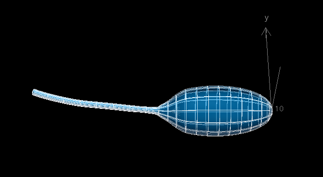
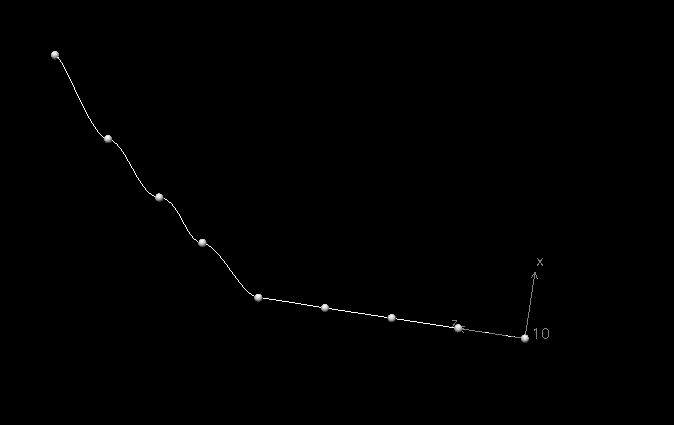
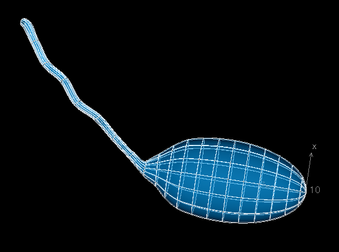

Example of visualising scaffolds
================================

In this example, we will visualize a scaffold, modify it using user interface, and then export its nodal parameters.

Once you have successfully installed and executed a new workflow, you should see ``scaffoldmaker`` window open.
In the left top corner, find :guilabel:`Mesh type` drop down list, and choose :guilabel:`3D Bladder with Urethra 1`.
Often, there are more than one version of parameter set
for each mesh type. Let's click on :guilabel:`Parameter set`, and select :guilabel:`Rat 1`.

Move your mouse upward while holding :kbd:`right mouse button` to zoom in, and
rotate the object by moving your mouse while holding :kbd:`left mouse button`.

You may notice there is a :guilabel:`Central path LUT` option under :guilabel:`Parameter set`
. Some mesh types have a special option which allows you
to modify multiple related nodes using a simpler geometry structure.
Click on it, you should see a 1D line mesh representing the urethra. Find :guilabel:`Node points` in the bottom left corner,
and make sure the box is ticked. Hold :kbd:`S` key, and you can drag node points using your :kbd:`left mouse button`.

Once you are happy with the shape, click :guilabel:`<< Back` on the top left corner. You should see the shape
of urethra has already changed.

You may found some meshes are quite big. If you see part of the mesh exceeds the coordinates system's limitation and disappears on screen,
You can rescale the mesh by holding :kbd:`A` + :kbd:`right mouse button`
and drag your mouse upward (an alternative way is to use the :guilabel:`Scale x, y , z` option). Remember to click on
:guilabel:`Apply transformation` for confirmation.

You can continue to modify the mesh. Once you have finished, click on :guilabel:`Print node parameters`, and change the number
format to ``.4f``, which represents floating point values with 4 decimal places. You should find all node parameters printed
in your terminal.

::

    [ Node.VALUE_LABEL_VALUE, Node.VALUE_LABEL_D_DS1, Node.VALUE_LABEL_D_DS2 ]
    [
    ( 1, [ [ 0.0000, 0.0000, 0.0000], [-3.1150, 0.0000, 0.0000], [ 0.0000, 3.1150, 0.0000] ] ),
    ( 2, [ [ 0.0000, 0.0000,-0.2000], [-3.1150, 0.0000, 0.0000], [ 0.0000, 3.1150, 0.0000] ] ),
    ( 3, [ [-0.0000, 2.3572, 1.3249], [-1.5708,-0.0000, 0.0000], [-0.0000, 1.9930, 2.4060] ] ),
    ( 4, [ [-1.5476, 2.1256, 1.3249], [-1.4979,-0.4729, 0.0000], [-1.4019, 1.7525, 2.3064] ] ),
    ...

